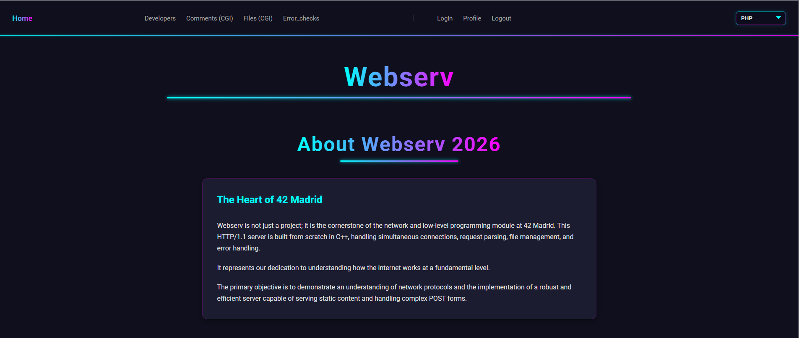
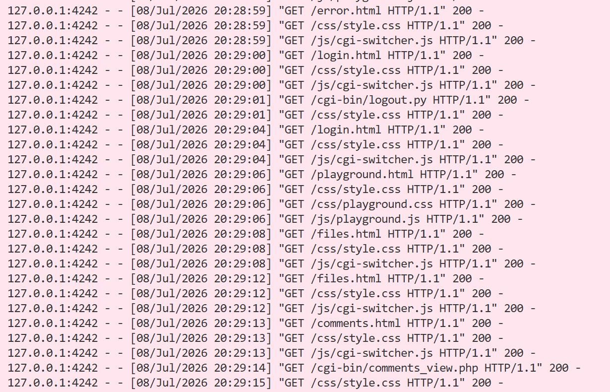

This project has been created as part of the 42 curriculum by **antoniof**, **jllamas-**, **mzolotar**.

# Webserv: 42 School Project

## Description

This project involves the development of a `C++98` compatible HTTP web server built from scratch. The server is designed to be non-blocking and uses I/O multiplexing (via poll()) to efficiently handle multiple concurrent client connections.

Key features include:
- **HTTP Methods**: Support for `GET`, `POST`, and `DELETE` requests.
- **Static Content**: Serving static files from a configured root directory.
- **File Uploads**: Handling file uploads from clients to the server.
- **CGI Execution**: Executing dynamic scripts (e.g., Python, PHP) based on file extensions.
- **Configuration**: A robust configuration system inspired by NGINX, allowing the definition of routes, error pages, and server limits via a `.conf` file.
- **Resilience**: Designed to remain operational at all times without crashing.

## Instructions
<section containing any relevant information about compilation,
installation, and/or execution.>

## Usage
```
./webserv [config_file]
```

## Debugging

| Status Code | Browser Implemented | Curl Command | Additional instructions |
|-------------|:-------------------:|--------------|--------------|
| 200 (OK) | - | <pre lang="bash"> curl -v http://127.0.0.1:4242/index.html  </pre> | - |
| 201 (Created) | - | <pre lang="bash"> curl -v -X POST -H "Content-Type: text/plain" -d "This is the test content for my POST" http://127.0.0.1:4242/uploads/test_curl.txt </pre> | The file must not already exist. |
| 204 (No Content) | - | <pre lang="bash">echo "brandom text input" > test_file.txt<br>mv test_file.txt website/uploads/test_file.txt<br>curl -v -X DELETE http://127.0.0.1:4242/uploads/test_file.txt</pre> | The file must not already exist. |
| 301 (Moved Permanently) | - | <pre lang="bash"></pre> | - |
| 302 (Found) | - Profile without login | <pre lang="bash"> curl -v [http://127.0.0.1:4242/cgi-bin/profile.py](http://127.0.0.1:4242/cgi-bin/profile.py) </pre> |
| 400 (Bad Request) | - | - | - |
| 403 (Forbidden) | - [Error_checks](http://127.0.0.1:4242/error.html) | <pre lang="bash"> curl -v http://127.0.0.1:4242/cgi-bin/no_permiss.php </pre> | CGI wiwh Permit No. -777 |
| 404 (Not Found) | [noexistURL](http://127.0.0.1:4242/index.htmlsfdf) | <pre lang="bash"> curl -v http://127.0.0.1:4242/index.htmlsdsad </pre> | - |
| 405 (Method Not Allowed) | - [Error_checks](http://127.0.0.1:4242/error.html) | <pre lang="bash"> curl -v -X DELETE http://127.0.0.1:4242/uploads/test_file.txt </pre> | Method implemented but not specified in the configuration file. |
| 413 (Payload Too Large) | - [Files (CGI)](http://localhost:4242/files.html) | <pre lang="bash">  curl -v -X POST -H "Content-Type: text/plain" -d "This is the test content for my POST" http://127.0.0.1:4242/uploads/test_curl.txt  </pre> | Change config file to: client_max_body_size 0M; |
| 500 (Internal Server Error) | [Error_checks](http://127.0.0.1:4242/error.html) | <pre lang="bash"> curl -v http://127.0.0.1:4242/cgi-bin/internal_server_error.py </pre> | - |
| 501 (Not Implemented) | - [Error_checks](http://127.0.0.1:4242/error.html) | <pre lang="bash"> curl -v -X BLA http://127.0.0.1:4242/index.html </pre> | - |


505 (HTTP Version Not Supported): 
```bash
printf "GET / HTTP/9.9\r\nHost: localhost\r\n\r\n" | nc localhost 4242
```

| *** | Browser Implemented | Curl Command |
|-------------|:-------------------:|--------------|
| - | [index](http://localhost:4242/index.html )| <pre lang="bash"> curl -v http://127.0.0.1:4242/index.html  </pre> |
| file (POST) | [CGI - file](http://localhost:4242/files.html) | <pre lang="bash"> curl -v -X POST -H "Content-Type: text/plain" -d "This is the test content for my POST" http://127.0.0.1:4242/uploads/test_curl.txt </pre> |
| file (DELETE) | [CGI - file](http://localhost:4242/files.html) | <pre lang="bash"> curl -v -X DELETE http://127.0.0.1:4242/uploads/test_curl.txt </pre> |
| comment (POST) | [CGI - comments](http://localhost:4242/comments.html) | <pre lang="bash"> curl -v -X POST -d "username=Debugger&subject=Prueba+Curl&comment=Esto+es+una+prueba+desde+la+terminal" http://127.0.0.1:4242/cgi-bin/comments_submit.py </pre> |
| comment (GET) | [CGI - comments](http://localhost:4242/comments.html) | <pre lang="bash"> curl -v http://127.0.0.1:4242/cgi-bin/comments_view.py </pre> |


## Stress Tests:

- Stress test with high concurrency
```bash
siege -b -c 100 -t 1m http://localhost:4242/
```
```bash
siege -r 100 -c 20 http://localhost:4242/
```

- Count open file descriptors for the server process.
```bash
lsof -i :4242 | grep LISTEN
```

- View established connections on the server port.
```bash
netstat -ant | grep 4242
```

## Output




## Resources
<section listing classic references related to the topic (documen-
tation, articles, tutorials, etc.), as well as a description of how AI was used — specifying for which tasks and which parts of the project.>

### **RFC**
An RFC (Request for Comments) is a formal technical document published by the Internet Engineering Task Force (IETF) that describes the protocols, methods, procedures, and research applicable to the Internet and network-connected systems.

- HTTP/1.0 → [RFC 1945](https://www.rfc-editor.org/rfc/rfc1945.html).
- HTTP/1.1 → [RFC 2616 (old)](https://datatracker.ietf.org/doc/html/rfc2616).

**HTTP** (Hypertext Transfer Protocol) is the foundational communication standard used to exchange information—like text, images, and video—on the World Wide Web.

- TCP → [RFC 793](https://datatracker.ietf.org/doc/html/rfc793).

The **Transmission Control Protocol** (TCP) is intended for use as a highly reliable **host-to-host protocol** between hosts in **packet-switched** computer communication networks, and in interconnected systems of such networks.


### **NGINX**:
-> [NGINX documentation](https://nginx.org/en/docs/index.html) 
-> [configuring server with NGINX](https://nginx.org/en/docs/http/configuring_https_servers.html).
-> [Beginner’s Guide](https://nginx.org/en/docs/beginners_guide.html)
-> [poll/epoll](https://nginx.org/en/docs/events.html): Connection processing methods
-> How nginx processes a [request](https://nginx.org/en/docs/http/request_processing.html)
-> [Server names](https://nginx.org/en/docs/http/server_names.html)
-> [Module ngx_http_core_module](https://nginx.org/en/docs/http/ngx_http_core_module.html)


### **Used Functions**
-> [Linux man pages online](https://man7.org/linux/man-pages/index.html)
-> [FreeBSD Manual Pages](https://man.freebsd.org/cgi/man.cgi)

### **CGI**
-> [CGI : Getting Started](http://www.mnuwer.dbasedeveloper.co.uk/dlearn/web/session01.htm)

### **Select and non-blocking**
-> [Non-blocking I/O](https://www.ibm.com/docs/en/i/7.2.0?topic=designs-example-nonblocking-io-select)
-> [Select](https://www.lowtek.com/sockets/select.html)


## **AI Usage**
This project utilized Google Gemini Pro (student lisence) as a technical mentor and documentation assistant. The AI was contextually configured with the full project subject (en.subject.pdf) to ensure strict adherence to 42 School constraints (C++98 standard, forbidden functions, and NGINX behavior imitation).

Role: The AI acted as a "virtual professor" or technical lead, facilitating architectural discussions for core classes and core concepts.

- Core Server (C++): The AI doesn't allowed to generate the final source code for the server's logic (parser, socket management, request/response handling). Its primary function was to validate logic, review specific C++ implementations for memory safety, and suggest best practices for "Clean Code."

- Test Assets (Website): AI tools were used to generate the content within the website/ directory (HTML, CSS, and basic CGI scripts). This allowed for efficient creation of testing materials to verify the server's features (such as static file serving and error handling) without diverting time from the mandatory backend implementation.
