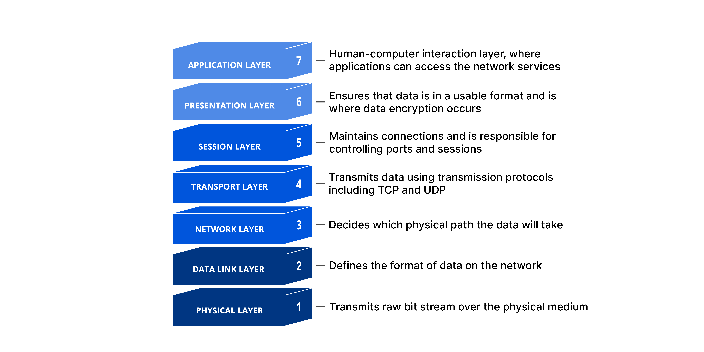
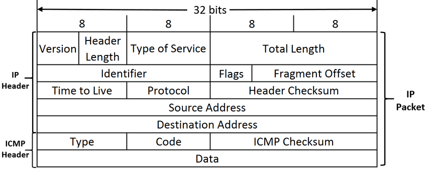

# ft_ping

A custom implementation of the classic network utility, recoded in C following the `inetutils-2.0` standard. This project interacts directly with the network layer using raw sockets to construct, transmit, and parse ICMP packets.

## Core Concepts

### 1. Network Architecture (OSI Model)
`ft_ping` operates between Layer 3 (Network) and Layer 4 (Transport) of the OSI model. It uses a raw socket (`SOCK_RAW`) to bypass transport layer protocols (TCP/UDP) and read/write raw IP packets with encapsulated ICMP payloads.



### 2. ICMP Packet Structure
The application constructs an `ICMP_ECHO` Request packet (Type 8) embedding a 64-bit timestamp (`struct timeval`) inside the data payload. When a host responds with an `ICMP_ECHOREPLY` (Type 0), the Round-Trip Time (RTT) is calculated by comparing the stored timestamp with the system's clock at reception.



---

## Technical Features

* **Strict Requirements:** Built entirely in C using authorized standard library network APIs (`socket`, `sendto`, `recvfrom`, `getaddrinfo`).
* **Precise Metrics:** Computes real-time RTT measurements providing minimum, maximum, average, and standard deviation (`mdev`) statistics with microsecond baseline precision.
* **Signal Driven Architecture:** Employs `SIGALRM` for deterministic 1-second transmission intervals and `SIGINT` for graceful shutdown, memory cleanup, and structural summary logging.
* **Packet Filtering:** Automatically discriminates process-specific identifiers via `getpid() & 0xFFFF` and discards self-transmitted loopback frames inside the raw buffer.

---

## Usage

### Compilation
Compile the project using the strict repository configurations:
```bash
make
#and
sudo ./ft_ping [options] <destination>
# or
sudo ./ft_ping <destination>
```